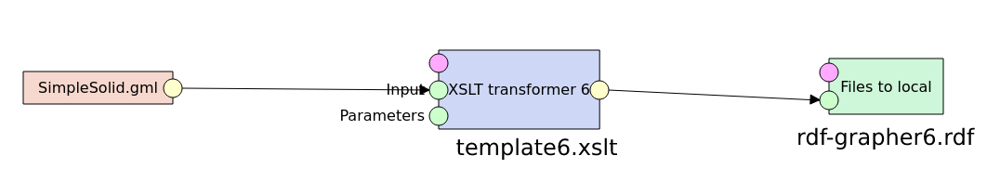

# XSLT_CityGML2-to-RDF
XSLT files for the transformation of citygml2 files into the rdf format. These are meant to be used with the [LinkedPipes ETL](https://github.com/linkedpipes/etl) Repo as ETL Tool. In this repository you can find the input/output files and also the json files, to import the pipeline into your LP ETL setup. 

## Tools
- [LinkedPipes ETL](https://github.com/linkedpipes/etl) Repo 
-  [Tutorial](https://etl.linkedpipes.com/tutorials/how-to/convert_xml_to_rdf) was used as a base to get started with the transformation process.
- [RDF Grapher](https://www.ldf.fi/service/rdf-grapher) was used to visualize the resulting graphs and save them as image.

## Pipeline setup
Architecture of the the pipeline for the the final test.

## CityGML2 source file
The CityGML2 file which was used in this test, can be found in this [Repository](https://gitlab.com/volkercoors/CiD4Sim/-/blob/master/SimpleSolid_SrefBS/v2.0/SimpleSolid_SrefBS.gml). It was renamed to *SimpleSolid.gml*.

The rendered house looks like this:

    

 
 

## Test setups
Two tests were performed, to get the final result. The first *gml-mini-test*, was used as a starting point for the project. The second *gml-simplesolid-test*, builds on the first and creates the final graph. In the respective test folders, u can find more information about them.

## Final output graph
The final graph can be found 
[here](./gml-simplesolid-test/graph-images/rdf-grapher6.svg) .

