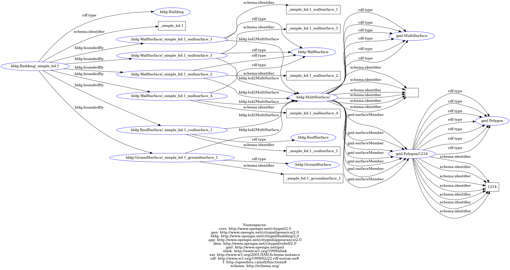
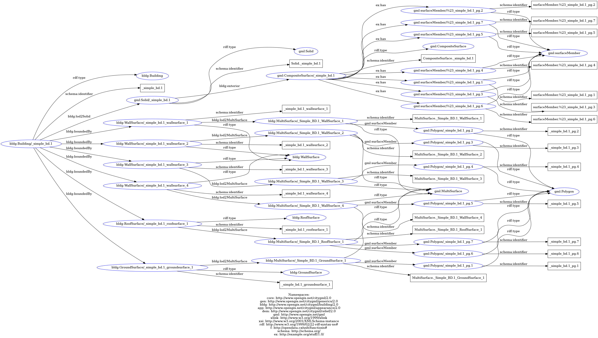
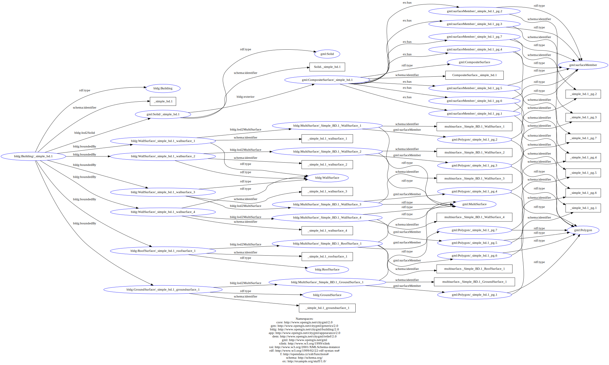
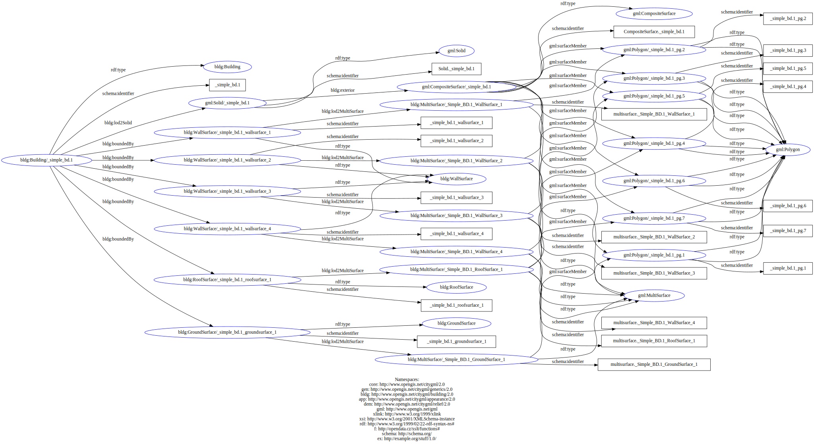

# simplesolid-test
This test ist based on the previous *gml-mini-test*. 

In the subfolders you can find the input/output data, resulting graph images and the json file for importing into the ETL pipeline.

## graph visualization 
The following pictures show the different stages of the graph.

- Graph#4 
    -  

- Graph#5 No working IDs
    -  

- Graph#6 wrong IDs
    -  

- Graph#6 wrong linkage to polygons, just over the schema:identifier (unnecessary long)
    -  

- Graph#7 fixed linkage
    -  
    The two rdf:type edges on the polygon entities are there, because of the graph rendering tool. In the output rdf file there is just one edge.

