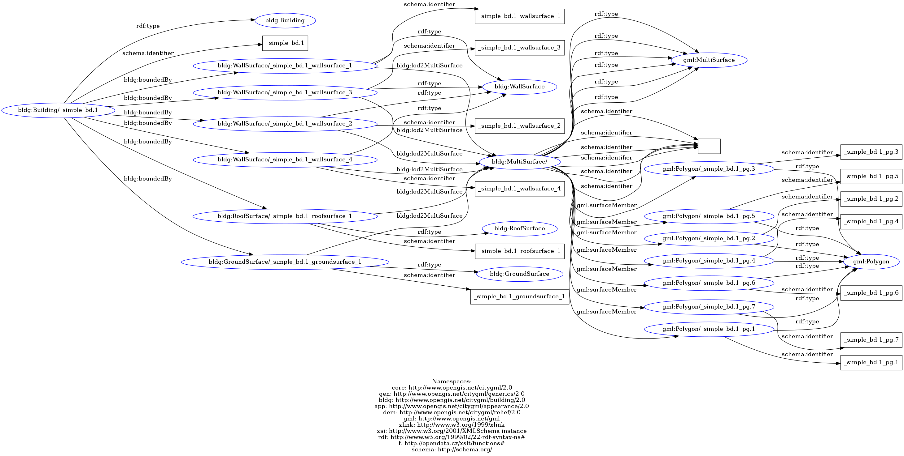

# simplesolid-test
This test ist based on the previous *gml-mini-test*. 

In the subfolders you can find the input/output data, resulting graph images and the json file for importing into the ETL pipeline.

## graph visualization 
The following pictures show the different stages of the graph.
- Graph#4 
    -  

- Graph#5
    -  

