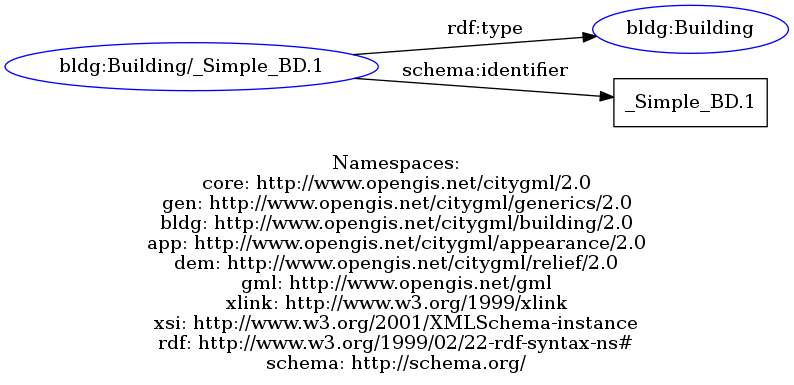
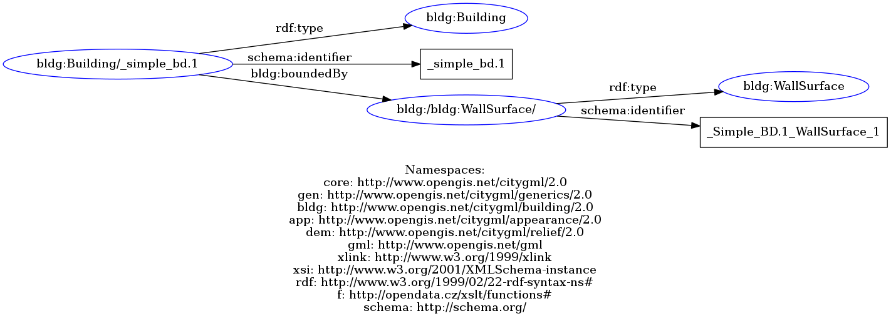
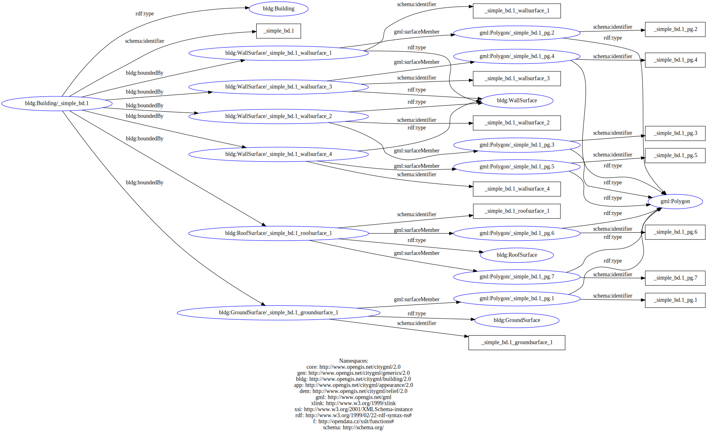

# gml-mini-test
Small test case for getting started with XSLT and understanding CityGML. At the beginning, the smaller *mini-test.gml* file was used. Later the whole *SimpleSolid.gml* was used for creating the third graph. 

In the subfolders you can find the input/output data, resulting graph images and the json file for the ETL pipeline.

## output rdf file
The resulting rdf files from the *mini-test.gml* file.

*rdf-grapher2.rdf:*
```xml
<?xml version="1.0" encoding="UTF-8"?>
<rdf:RDF xmlns:core="http://www.opengis.net/citygml/2.0"
         xmlns:gen="http://www.opengis.net/citygml/generics/2.0"
         xmlns:bldg="http://www.opengis.net/citygml/building/2.0"
         xmlns:app="http://www.opengis.net/citygml/appearance/2.0"
         xmlns:dem="http://www.opengis.net/citygml/relief/2.0"
         xmlns:gml="http://www.opengis.net/gml"
         xmlns:xlink="http://www.w3.org/1999/xlink"
         xmlns:xsi="http://www.w3.org/2001/XMLSchema-instance"
         xmlns:rdf="http://www.w3.org/1999/02/22-rdf-syntax-ns#"
         xmlns:f="http://opendata.cz/xslt/functions#"
         xmlns:schema="http://schema.org/">

   <bldg:Building rdf:about="bldg:Building/_simple_bd.1">
      <schema:identifier>_simple_bd.1</schema:identifier>
      <bldg:boundedBy>
         <bldg:WallSurface rdf:about="http://www.opengis.net/citygml/building/2.0/bldg:WallSurface/">
            <schema:identifier>_simple_bd.1_wallsurface_1</schema:identifier>
            _simple_bd.1_wallsurface_1
            </bldg:WallSurface>
      </bldg:boundedBy>
   </bldg:Building>
   
</rdf:RDF>
```

## graph visualization 
The following pictures show the different graphs, that are the results of the transformation with the *template.xslt* file in the ETL pipeline.
- Graph#1
    -  

- Graph#2
    -  

- Graph#3
    - 

